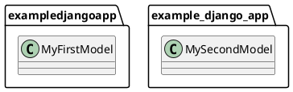

# uml2django

Generate [Django](https://www.djangoproject.com/) code from [PlantUML class diagrams](https://plantuml.com/class-diagram>).

uml2django is able to generate: 

* Models
* Forms 
* Class Based Views
* Templates


## Syntax

**Apps**

* To represent an Django App, use the PlantUML ``package`` tag.
* The app name must follow [pep8](https://peps.python.org/pep-0008/#package-and-module-names):
  *Modules and packages should have short, all-lowercase names.*
  *Underscores can be used if it improves readability,*
  *although the use of underscores is discouraged.*

```
@startuml
    package exampledjangoapp {
        
    }
    package example_django_app {
        
    }
@enduml
```

**Models**

* Use PlantUML ``class`` tag to represent an Django Model.
* The Model name must follow `pep8 <https://peps.python.org/pep-0008/#class-names>`_ :  
  *where stands that class names should normally use the CapWords convention.*
* All classes defined MUST BE inside an package, like models inside Django apps.::




**Model Fields**

* Use PlantUML ``{field}`` tag to represent an Django model field.
* If the field type is not informed, uml2django define it as CharField.

```
@startuml
    package exampledjangoapp {
        class MyFirstModel {
            {field} char_field : CharField(max_length=30)
            {field} other_char_field
        }
    }
    package example_django_app {
        class MySecondModel {
            {field} integer_field : IntegerField()
        }
    }
@enduml
```
